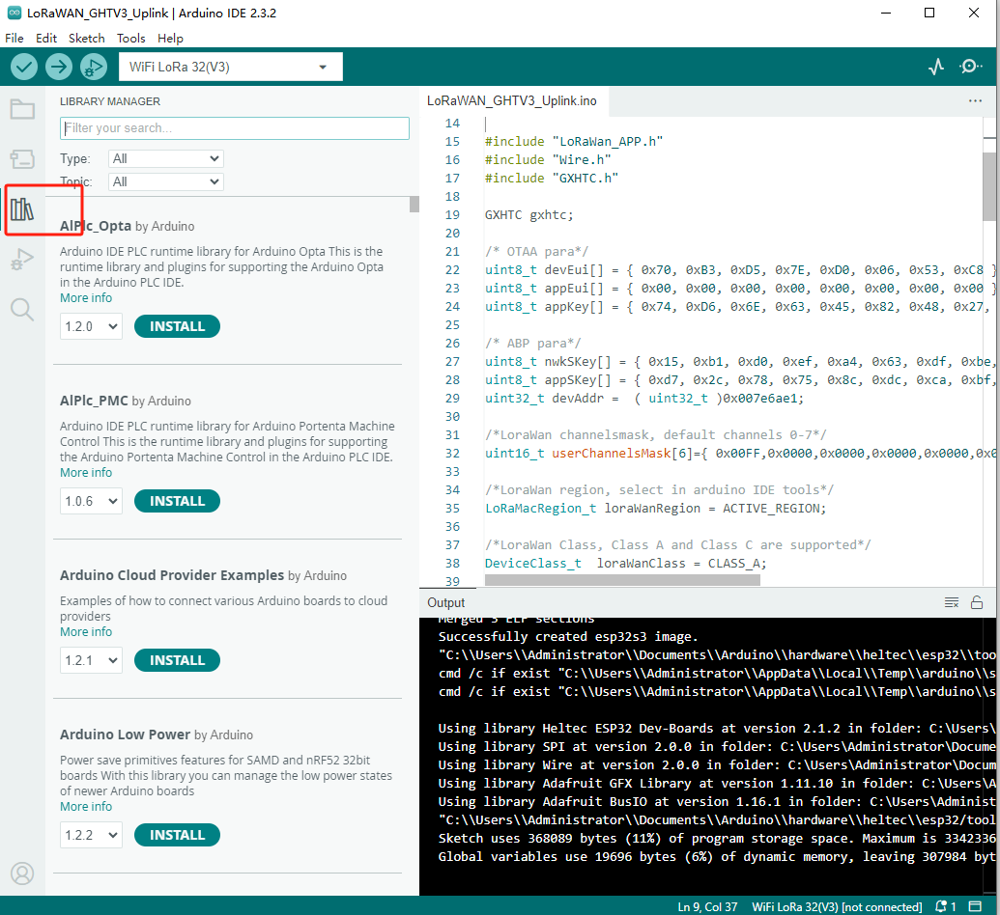
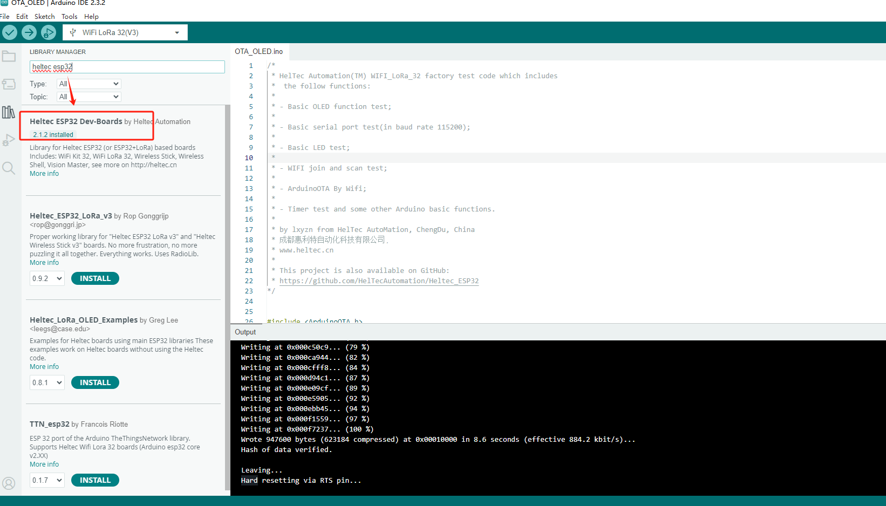

# Heltec_ESP32 Library

English | [简体中文](#简体中文)

**This library requires installation of the [Heltec ESP32 development framework](https://github.com/Heltec-Aaron-Lee/WiFi_Kit_series)! A detailed document about how to install the Heltec ESP32 development framework and this library available here:**

[Heltec ESP32+LoRa Series Quick Start — esp32 latest documentation](https://docs.heltec.org/en/node/esp32/esp32_general_docs/quick_start.html)

## CONTENT

1. [How to install this library](#how-to-install-this-library)
	- [Use Arduino Library Manager](#use-arduino-library-manager)
	
	- [Use Git](#use-git)
	
2. [How to use this library](#how-to-use-this-library)

3. [API Reference](#api-reference)

4. [Relevant Resources](#relevant-resources)

***

## How to install this library

*`We recommend using the Arduino library manager, it's the simplest way`*

### Use Arduino Library Manager

Open Arduino IDE, then Select `Sketch`->`Include Library`->`Manage Libraries...`
Search `Heltec ESP32` and install it.

&nbsp;

### Use Git

*Firstly, make sure git and the Arduino IDE have been installed first. If not, please refer [How to install Git and Arduino IDE](https://docs.heltec.org/general/how_to_install_git_and_arduino.html). When Arduino is installed correctly, you will find a folder in "Username/Documents/Arduino/Library". **this library must in this path!***

Open "Git bash" in path `Username/Documents/Arduino/Library`, and input:

    git clone https://github.com/HelTecAutomation/Heltec_ESP32.git

You will see such a new folder in your library path, install done.

## How to use this library

**This library requires the [Heltec ESP32 develop framework](https://github.com/Heltec-Aaron-Lee/WiFi_Kit_series)!**

A detailed step by step instructions to execute some examples available here:

[Heltec ESP32+LoRa Series Quick Start — esp32 latest documentation](https://docs.heltec.org/en/node/esp32/esp32_general_docs/quick_start.html)

## API Reference

[OLED API](src/oled/API.md)

[LoRa API](src/lora/API.md)

## Relevant Resources

- [WiFi Kit 32](https://resource.heltec.cn/download/WiFi_Kit_32)

- [WiFi LoRa 32](https://resource.heltec.cn/download/WiFi_LoRa_32)

- [Wireless Stick](https://resource.heltec.cn/download/Wireless_Stick)

- [Wireless Stick Lite](https://resource.heltec.cn/download/Wireless_Stick_Lite)

- [Wireless Shell](https://resource.heltec.cn/download/Wireless_Shell)

- [WIFI Kit 32(v3)](https://resource.heltec.cn/download/WiFi_Kit_32_V3)

- [WIFI LoRa 32(v3)](https://resource.heltec.cn/download/WiFi_LoRa_32_V3)

- [Wireless Stick(v3)](https://resource.heltec.cn/download/Wireless_Stick_V3)

- [Wireless Stick Lite(v3)](https://resource.heltec.cn/download/Wireless_Stick_Lite_V3)

- [Wireless Paper](https://resource.heltec.cn/download/Wireless_Paper)

- [Wireless Tracker](https://resource.heltec.cn/download/Wireless_Tracker)

- [Ct62](https://resource.heltec.cn/download/Ct62)

- [Wireless Shell(v3)](https://resource.heltec.cn/download/Wireless_Shell_V3)

- [HT-DE01](https://resource.heltec.cn/download/HT-DE01)

  

If there is a "Limited" folder in the resources page, it means the product have limited resources that not public by default, refer to this document to download: [Get Limited Technical Resources](https://docs.heltec.org/general/view_limited_technical_data.html).

#### Note:
Please make sure use a high-quality Micro USB cable, it will reduce many problems.

[Summary of common problems](https://docs.heltec.org/en/node/esp32/esp32_general_docs/frequently_asked_questions.html)

&nbsp;

***
***
&nbsp;

## 简体中文

**这个Arduino库必须配合[Heltec ESP32编译环境](https://github.com/Heltec-Aaron-Lee/WiFi_Kit_series)一起使用！完整的“编译环境 + 库”的的教程可以参考这里：**

[Heltec ESP32+LoRa Series Quick Start — esp32 latest documentation](https://docs.heltec.org/en/node/esp32/esp32_general_docs/quick_start.html)

***

## 目录

1. [安装方法](#安装方法)
	- [通过Arduino库管理器安装](#通过Arduino库管理器安装)
	
	- [通过Git进行安装](#use-git)
	
2. [怎样使用这个库](#怎样使用这个库)

3. [API参考](#API参考)

4. [相关资源](#相关资源)

***

## 安装方法

*`强烈推荐使用Arduino自带的“库管理器”进行安装!`*

### 通过Arduino库管理器安装

打开Arduino IDE, 选择`项目`->`加载库`->`管理库...`，打开“库管理器”
搜索`Heltec ESP32`并安装.

&nbsp;

### 通过Git进行安装

*首先,请确保`Git`和`Arduino IDE`都已经正确安装。如果没有，请参考这里的安装方法[怎样安装Git和Arduino IDE](https://docs.heltec.org/general/how_to_install_git_and_arduino.html)。 *

**强调一下：这个库的路径必须位于操作系统的“文档/Arduino/libraries”文件夹内！！！文档文件夹是操作系统自带的，必须！必须！必须！**

在“文档/Arduino/libraries”路径下打开"Git bash"，输入:

    git clone https://github.com/HelTecAutomation/Heltec_ESP32.git

如果一切正常，应该是这样的

## 怎样使用这个库

如何运行一个例程？详细的使用指南：:

[Heltec ESP32+LoRa Series Quick Start — esp32 latest documentation](https://docs.heltec.org/en/node/esp32/esp32_general_docs/quick_start.html)

## API参考
[OLED API](src/oled/API.md)

[LoRa API](src/lora/API.md)

## 相关资源

- [WiFi Kit 32](https://resource.heltec.cn/download/WiFi_Kit_32)
- [WiFi LoRa 32](https://resource.heltec.cn/download/WiFi_LoRa_32)
- [Wireless Stick](https://resource.heltec.cn/download/Wireless_Stick)
- [Wireless Stick Lite](https://resource.heltec.cn/download/Wireless_Stick_Lite)
- [Wireless Shell](https://resource.heltec.cn/download/Wireless_Shell)
- [WIFI Kit 32(v3)](https://resource.heltec.cn/download/WiFi_Kit_32_V3)
- [WIFI LoRa 32(v3)](https://resource.heltec.cn/download/WiFi_LoRa_32_V3)
- [Wireless Stick(v3)](https://resource.heltec.cn/download/Wireless_Stick_V3)
- [Wireless Stick Lite(v3)](https://resource.heltec.cn/download/Wireless_Stick_Lite_V3)
- [Wireless Paper](https://resource.heltec.cn/download/Wireless_Paper)
- [Wireless Tracker](https://resource.heltec.cn/download/Wireless_Tracker)
- [Ct62](https://resource.heltec.cn/download/Ct62)
- [Wireless Shell(v3)](https://resource.heltec.cn/download/Wireless_Shell_V3)
- [HT-DE01](https://resource.heltec.cn/download/HT-DE01)

如果在资源下载页中看到了`Limited`文件夹，表面这个产品有非公开的技术资料。[获取受限资源的方法](https://docs.heltec.org/general/view_limited_technical_data.html)

