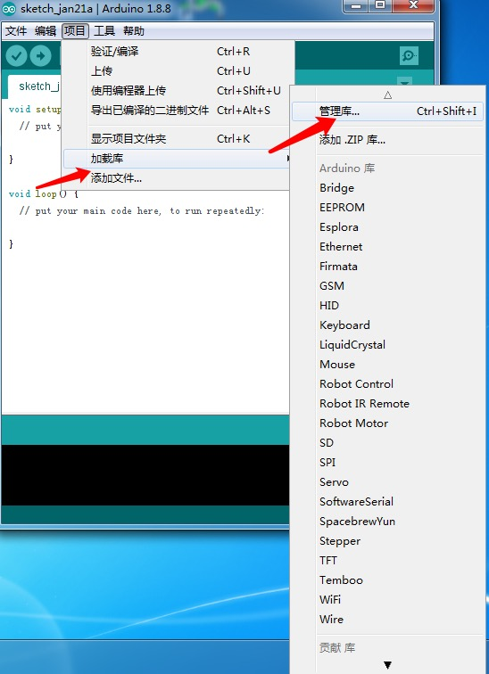
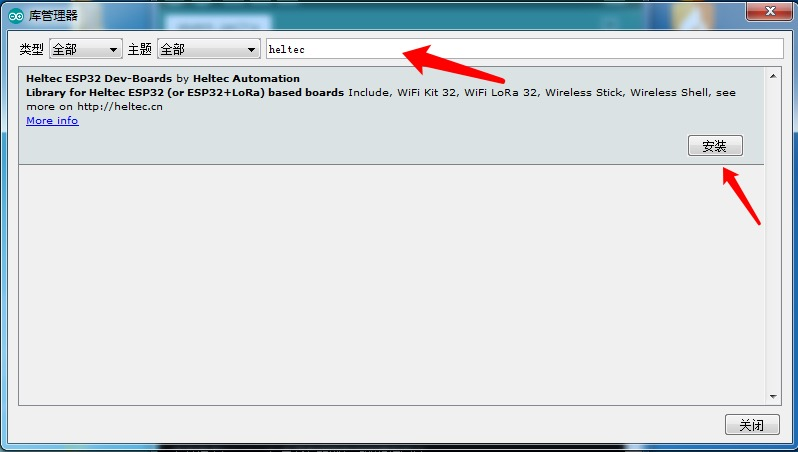
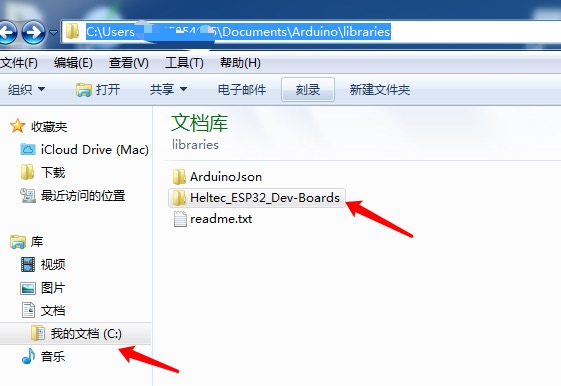

# Heltec_ESP32 Library

English | [简体中文](#简体中文)

This library need work with ESP32 development enviroment.
[Heltec ESP32 & ESP8266 Series Arduino Develop Environment](https://github.com/HelTecAutomation/Heltec_ESP32)

## 1. Now Get Started

#### Here is the way to get started

*For MacOS*
git clone the library in your  Arduino,it is like  finder－ /文稿（Document）/Arduino/libraries/Heltec_ESP32

*For Windows*
two ways to download and update the library

-one is git clone the library in your  Arduino,it is like  C:\Users\***\Documents\Arduino\libraries\Heltec_ESP32

-the other is open your [Arduino IDE](https://www.arduino.cc/en/Main/Software)

-Click on Project - Load Library - Manage Library

-Search for "heltec" in the library manager and download

You will find the installed library in the following directory.

## 2. Example
https://github.com/HelTecAutomation/Heltec_ESP32/tree/master/examples

## 3. API Reference
[OLED API](https://github.com/HelTecAutomation/Heltec_ESP32/blob/master/src/oled/OLEDDisplay.h)

[LoRa API](src/lora/API.md)

## 4. H/W Reference

### PinoutDiagram
https://github.com/Heltec-Aaron-Lee/WiFi_Kit_series/tree/master/PinoutDiagram
### Schematic Diagram
https://github.com/Heltec-Aaron-Lee/WiFi_Kit_series/tree/master/SchematicDiagram

#### Note:
* ESP series chips are faster to download, please make sure to use the high-quality Micro USB cable,  it will be easy to download.

[Summary of common problems](http://www.heltec.cn/summary-of-common-problems-in-wifi-kit-series-continuous-update/?lang=en)

## 简体中文

该库需要与ESP32开发环境协同工作[ESP32和esp8266开发环境]（https://github.com/Heltec-Aaron-Lee/WiFi_Kit_series）

### 1. 以下是Heltec_ESP32库的安装方法

*MacOS*
克隆本库到本地，路径：finder－ /文稿（Document）/Arduino/libraries/Heltec_ESP32

*Windows*
有以下两种方法下载并持续更新此库

- 一种是克隆本库到本地，路径： C:\Users\***\Documents\Arduino\libraries\Heltec_ESP32

- 另一种是打开最新版[Arduino IDE](https://www.arduino.cc/en/Main/Software)

-点击项目 - 加载库 - 管理库

-在库管理器中搜索“heltec”安装

安装成功后会发现以下文件

## 2. 例程
https://github.com/HelTecAutomation/Heltec_ESP32/tree/master/examples

## 3. API参考
[OLED API](https://github.com/HelTecAutomation/Heltec_ESP32/blob/master/src/oled/OLEDDisplay.h)

[LoRa API](src/lora/API.md)

## 4. 引脚图参考

https://github.com/Heltec-Aaron-Lee/WiFi_Kit_series/tree/master/PinoutDiagram

### 原理图参考

https://github.com/Heltec-Aaron-Lee/WiFi_Kit_series/tree/master/SchematicDiagram

#### 注意事项:
* ESP系列芯片下载速度更快，请务必使用高品质的Micro USB线，否则不便于下载。

[Summary of common problems](http://www.heltec.cn/summary-of-common-problems-in-wifi-kit-series-continuous-update/?lang=en)

