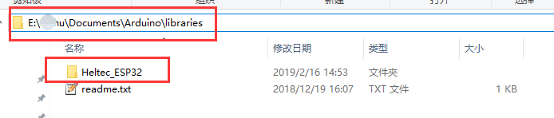
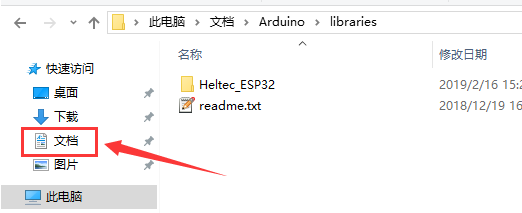

# Heltec_ESP32 Library

English | [简体中文](#简体中文)

**This library must work with [Heltec ESP32 develop framework](https://github.com/Heltec-Aaron-Lee/WiFi_Kit_series)! A detail document about how to install Heltec ESP32 development framework and this library available here:**

**[http://docs.heltec.cn/#/en/user_manual/how_to_install_esp32_Arduino](http://docs.heltec.cn/#/en/user_manual/how_to_install_esp32_Arduino)**

## CONTENT

1. [How to install this library](#how-to-install-this-library)

	- [Use Arduino Library Manager](#use-arduino-library-manager)

	- [Use Git](#use-git)

2. [How to use this library](#how-to-use-this-library)

3. [API Reference](#api-reference)

4. [Hardware Reference](#hardware-reference)

	- [PinoutDiagram](#pinoutdiagram)

	- [Schematic Diagram](#schematic-diagram)

***

## How to install this library
*`We recommedn use Arduino library manager, it's the simplest way`*

### Use Arduino Library Manager
Open Arduino IDE, then Select `Sketch`->`Include Library`->`Manage Libraries...`
Search `Heltec ESP32` and install it.

### Use Git

*Firstly, makse sure `Git` and `Arduino IDE` has installed first. If not, please refer [How to install Git and Arduino](http://docs.heltec.cn/#/en/user_manual/how_to_install_git_and_arduino). For correctly installed Arduino, you will find a folder in "Username/Documents/Arduino/Library". **this library must in such a path!***

Open "Git bash" in path "Username/Documents/Arduino/Library", and input:

    git clone https://github.com/HelTecAutomation/Heltec_ESP32.git

You will see such a new folder in your library path, install done.

## How to use this library

**`This library must work with [Heltec ESP32 develop framework](https://github.com/Heltec-Aaron-Lee/WiFi_Kit_series)!`**

A detail steps to execute some examples available here:

[http://docs.heltec.cn/#/en/user_manual/how_to_install_esp32_Arduino?id=_1-execute-a-example-likes-factorytestino](http://docs.heltec.cn/#/en/user_manual/how_to_install_esp32_Arduino?id=_1-execute-a-example-likes-factorytestino)

## API Reference
[OLED API](https://github.com/HelTecAutomation/Heltec_ESP32/blob/master/src/oled/OLEDDisplay.h)

[LoRa API](src/lora/API.md)

## Hardware Reference

### PinoutDiagram
[https://github.com/Heltec-Aaron-Lee/WiFi_Kit_series/tree/master/PinoutDiagram](https://github.com/Heltec-Aaron-Lee/WiFi_Kit_series/tree/master/PinoutDiagram)
### Schematic Diagram
[https://github.com/Heltec-Aaron-Lee/WiFi_Kit_series/tree/master/SchematicDiagram](https://github.com/Heltec-Aaron-Lee/WiFi_Kit_series/tree/master/SchematicDiagram)

#### Note:
* ESP series chips are faster to download, please make sure to use the high-quality Micro USB cable,  it will be easy to download.

[Summary of common problems](http://www.heltec.cn/summary-of-common-problems-in-wifi-kit-series-continuous-update/?lang=en)

&nbsp;
***
***
&nbsp;

## 简体中文

**这个Arduino库必须配合[Heltec ESP32编译环境](https://github.com/Heltec-Aaron-Lee/WiFi_Kit_series)一起使用！完整的“编译环境 + 库”的的教程可以参考这里：**

**[http://docs.heltec.cn/#/en/user_manual/how_to_install_esp32_Arduino](http://docs.heltec.cn/#/en/user_manual/how_to_install_esp32_Arduino)**

***

## 目录

1. [安装方法](#安装方法)

	- [通过Arduino库管理器安装](#通过Arduino库管理器安装)

	- [通过Git进行安装](#use-git)

2. [怎样使用这个库](#怎样使用这个库)

3. [API参考](#API参考)

4. [硬件设计参考](#硬件设计参考)

	- [引脚图](#引脚图)

	- [原理图](#原理图)

***

## 安装方法
*`强烈推荐使用Arduino自带的“库管理器”进行安装!`*

### 通过Arduino库管理器安装
打开Arduino IDE, 选择`项目`->`加载库`->`管理库...`，打开“库管理器”
搜索`Heltec ESP32`并安装.

### 通过Git进行安装

*首先,请确保`Git`和`Arduino IDE`都已经正确安装。如果没有，请参考这里的安装方法[How to install Git and Arduino](http://docs.heltec.cn/#/en/user_manual/how_to_install_git_and_arduino)。 *

**强调一下：这个库的路径必须位于操作系统的“文档/Arduino/libraries”文件夹内！！！文档文件夹是操作系统自带的，必须！必须！必须！**

在“文档/Arduino/libraries”路径下打开"Git bash"，输入:

    git clone https://github.com/HelTecAutomation/Heltec_ESP32.git

如果一切正常，应该是这样的

## 怎样使用这个库

如何运行一个例程？详细的使用指南：:

[http://docs.heltec.cn/#/en/user_manual/how_to_install_esp32_Arduino?id=_1-execute-a-example-likes-factorytestino](http://docs.heltec.cn/#/en/user_manual/how_to_install_esp32_Arduino?id=_1-execute-a-example-likes-factorytestino)

## API参考
[OLED API](https://github.com/HelTecAutomation/Heltec_ESP32/blob/master/src/oled/OLEDDisplay.h)

[LoRa API](src/lora/API.md)

## 硬件设计参考

### 引脚图
[https://github.com/Heltec-Aaron-Lee/WiFi_Kit_series/tree/master/PinoutDiagram](https://github.com/Heltec-Aaron-Lee/WiFi_Kit_series/tree/master/PinoutDiagram)
### 原理图
[https://github.com/Heltec-Aaron-Lee/WiFi_Kit_series/tree/master/SchematicDiagram](https://github.com/Heltec-Aaron-Lee/WiFi_Kit_series/tree/master/SchematicDiagram)

