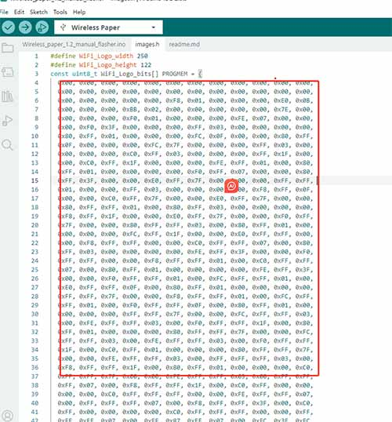
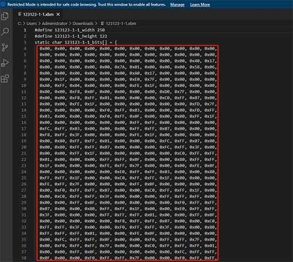

Set the image resolution to 250*122(consistent with the settings in **image.h**) and convert it to XBM.

Open the XBM file with VSCode or Notepad, then copy the image code. 

Paste the code into image.h. 

